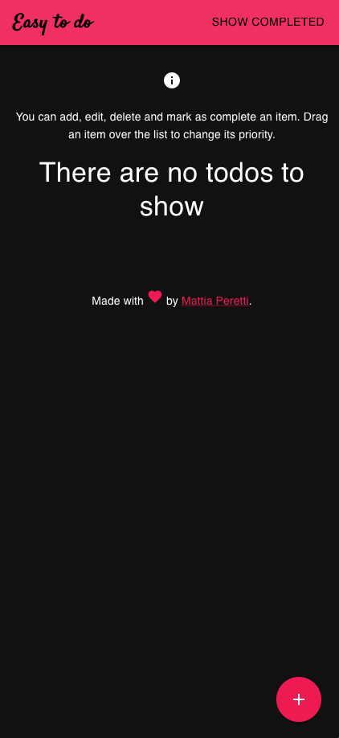

# Easy to do

This todo app offers a simple way to manage a list of tasks someone needs to complete or things that someone wants to do.



This app work flawlessly on desktop and mobile screen.


## Items can be added, removed, updated and listed via UI
Using the interface, an user is able to add, remove, update and list items.

## Items can be prioritized
Using drag and drop feature the user is able to change the priority of the items.
Top is the highest priority, bottom is the lower.
## Items can be completed
Once an item has been done, it can be marked as completed. Item like this can be visible in *show completed* section using the top bar button. Items in this section are ordered by completed date in descending order (the last completed is on the top).
## Item

An item is an object with the following fields:

- `id` to identify the item;
- `description` contains the text of the item;
- `order` a number used to order the element into a list;
- `completed` true if the item is completed, false otherwise;
- `completedDate` a string object in `RFC822Z` format.

## Docker compose
I used multi env `Dockerfile` to avoid loading source file into docker images. You can find more info into the dockerfiles.

You can run client and server application with one command using docker compose:

```bash
docker compose up -d
```

- The client expose port `8000`. You can access using [http://localhost:8000](http://localhost:8000)
- The server expose port `8080`. You can access to `/` using [http://localhost:8080](http://localhost:8080)

### Storage
The store used is a simple file system store and it's persistent thanks to a docker volume.

This means if you remove containers and images your data is not lost. You can reload you docker container and all your data will be there.
## Testing
Refer to testing sections for client and server `Readme`s:

- [Client](./client/README.md)
- [Server](./server/README.md)