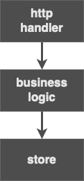

# ToDo App - server

This server is implemented in Go.

Items can be added, removed, updated and listed.

## Introduction
I never developed in Golang but I wanted to do the best work possible.
I've created a three-layer structure to separated these concerns:

- *handler*
- *business logic*
- *store*



I've tried to made each layer independent from the others.
In that way there could be a lot of independent improvements and different implementations.

### A note about the store
I've choose to store every todo in item in a simple file system store. This choise was made for time-boundary constraints but I think this is a good choise for an app like this. Despite this, I've created a store interface, useful for future implementations, like a DBMS store.

## Structure
- `api` contains the tests and the source code of the handler layer:
  - a custom middleware was written to add CORS headers to the response;
- `core` contains the tests and the source code of the business logic layer;
- `store` contains the tests and the source code of the store layer.
  - `itemStore.go` is an interface used to implements every store solution;
  - `fileSystemStore.go` is a concrete implementation of `ItemStore` and store information into a `json` file;
- `model` contains `item.go` that represents a todo item;
- `helpers` contains useful functions. Now it contains only `slices.go` with a filter functions built with generics used to filter a slice;
- `testing` contains useful functions used in tests;
- `db` is `.gitkeep` folder used to write the `json` database file.
## Apis

The server implements the following api endpoints:

- `GET /items/{id}`: returns a single item using `id`;
- `GET /items`: returns all live todo items;
- `GET /items/completed`: returns all completed todo items;
- `POST /items`: creates a new todo item;
- `PUT /items/{id}`: updates an existing item using `id`;
- `DELETE /items/{id}`: deletes an existing item using `id`.
- `PATH /items/reorder/{sourceId}/{targetId}`: reorder the item with `sourceId` to the order position of `targetId`.
- `GET /`: it shows a message from the future;

## Usage

### Install
Install the dependencies using the command

```bash
go mod download
```

### Build and start

Build the server with the command

```bash
go build -o server
```

and use

```bash
./server
```

to start it.

#### Environment
As for `.env` files it uses `database.json` as default database name and it uses port `8080` to expose http handlers.

### Testing

I've used the standard go library for testing and `assert` package for assertions. There are no integration tests.

#### How to test
Launch the test using the command

```bash
go test ./...
```

For coverage info use the command

```bash
go test -v -coverprofile cover.out ./...
```

## Improvements
One of the main improvements to this server could be integration tests.

On implementation side, the server lacks some logs and return statement with more verbose message.