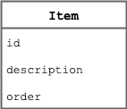

# ToDo App - server

This server is implemented in Go.

Items can be added, removed, updated and listed.

## Apis

The server implements the following api endpoints:

- `GET /items/{id}`: returns a single item using `id`;
- `GET /items`: returns all todo items;
- `POST /items`: creates a new todo item;
- `PUT /items/{id}`: updates an existing item using `id`;
- `DELETE /items/{id}`: deletes an existing item using `id`.

## Item

An item is an object with the following fields:

- `id` to identify the item;
- `description` contains the text of the item;
- `order` a number used to order the element into a list.
